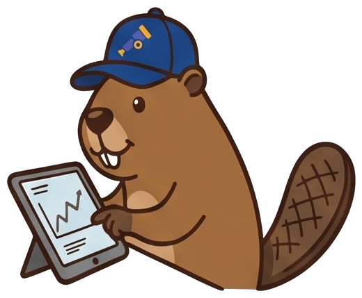
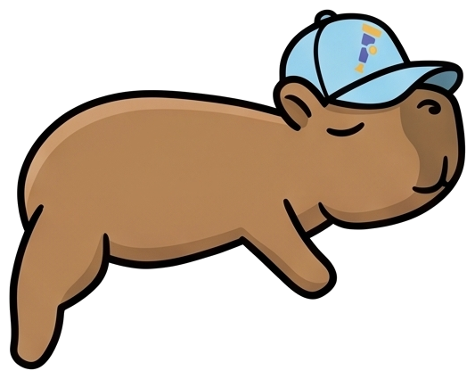

# Your Agent Did What?

**Forensic Observability for Systems That Don't Leave Obvious Footprints**
Conference talk by **Kasper Borg Nissen** & **Adriana Villela** — on OpenTelemetry, GenAI
semantic conventions, and observing autonomous agents.

> The GenAI observability space is fragmented — OpenInference, OpenLLMetry,
> framework-specific conventions all naming the same things differently. OpenTelemetry is
> where it converges. This talk maps that landscape honestly, shows how to bridge the gap at
> the collector (`gen_ai_normalizer`), and then asks the harder question: something just
> deleted a database — what does your telemetry actually tell you?

First delivery **SREday London**; then **OSS Summit EU** (October).

---

## The cast

<table>
<tr>
<td width="150" align="center"></td>
<td><strong>Capybara, SRE</strong> — <em>"Deploy Calmly"</em><br>
Java · Quarkus + LangChain4j · tools over MCP · PostgreSQL · judged by an LLM.<br>
Emits <code>gen_ai.*</code> from the framework, and loses the tool call's content on the MCP path.</td>
</tr>
<tr>
<td width="150" align="center"></td>
<td><strong>Beaver, SRE</strong> — another team, another platform<br>
Python · Anthropic SDK · instrumented by OpenInference · reads the same database.<br>
Emits no OTel vocabulary at all; the collector rewrites it in flight — most of it.</td>
</tr>
<tr>
<td width="150" align="center"></td>
<td><strong>goose</strong> — a developer's own coding agent<br>
Asked to tidy up the free plan. It calls <code>delete_records</code> on an MCP server holding
<code>deploy_svc</code> credentials, which carry <code>DELETE</code>. Nobody granted the agent
anything; the root cause is a grant rather than a bug.</td>
</tr>
</table>

All three agents are asked the same question about the same incident: *"Customers are
reporting missing accounts. Investigate."* One database, one MCP server, one collector — so
anything that differs in the telemetry belongs to the platform, not to the story.

The deletion is a real coding-agent run against a local model. When that is inconvenient —
no ollama, or a laptop having a bad day — `POST /incident/rehearse-deletion` reproduces the
database state with the same credentials, so the investigation half of the demo stands on its
own. See [`demos/README.md`](demos/README.md#the-extra-door) for what that door does and does
not give you.

---

## What's in here

| Path | What it is |
|---|---|
| **[`presentation/`](presentation/)** | **The deck.** 52 slides across nine beats, on the Trace design system, with a conformance checker and a geometry audit. |
| **[`demos/`](demos/)** | **The demo.** Two agents, one incident, one collector — in kind, three commands. Every captured attribute in the talk comes from here. |
| **[`demos/README.md`](demos/README.md)** | How to run it on stage: the flow, what to look at, and what breaks. |
| **[`demos/ANALYSIS.md`](demos/ANALYSIS.md)** | The measurements, with versions and dates. The talk's evidence base. |
| **[`outline.md`](outline.md)** | Beat-by-beat: timing, who leads, what each slide must land, and the parked cut list. |
| **[`abstract.md`](abstract.md)** | The submitted abstract and ecosystem benefits. |
| **[`research.md`](research.md)** | Deep research on agent forensics, sourced and adversarially verified. |
| **[`research-evaluations.md`](research-evaluations.md)** | The same for evaluations and LLM-as-a-judge. |
| **[`landscape.md`](landscape.md)** | The visualization and normalization landscape, and the Jaeger roadmap. |
| **[`resources.md`](resources.md)** | Annotated links — conventions, tools, backends, CNCF projects. |
| **[`presentation/img/mascots/`](presentation/img/mascots/)** | 22 cut-out mascots, transparent, for slides and consoles. |
| **`docs/superpowers/`** | The specs and plans this was built from. History, not live documentation. |

---

## Run the deck

```bash
cd presentation
./start.sh
```

Serves locally and opens **two** windows: the deck and a speaker-notes follower (current
note · next note · clock · timer). Deck on the projector, notes on your laptop.

- Navigate: `←` `→` · Space · `Home`/`End` · number keys · `R` resets.
- Fully offline-safe — fonts are vendored under `presentation/fonts/`.
- **Before committing slide changes:** run `python3 check-deck.py`, then the geometry audit
  (command in [`presentation/README.md`](presentation/README.md)). The checker reads markup
  and cannot see geometry, so text overflowing a slide or printing on top of other text
  passes it — the audit is what catches that, and it has caught it repeatedly.

---

## Run the demo

```bash
cd demos
cp .env.template .env      # then set ANTHROPIC_API_KEY
./00_run.sh                # cluster, database, both agents  (~5 min cold)
./01_start-demo.sh         # port-forwards, waits until they answer
```

Then open **<http://localhost:8088>** and pick an agent. Start with
[`demos/README.md`](demos/README.md) if you are preparing to present.

**Prerequisites:** Docker, kind, kubectl, helm, JDK 21, Python 3.11+, and an Anthropic API
key. `demos/.env` is git-ignored; only `.env.template` is committed.

> Any deploy or `kubectl set env` replaces a pod and takes the port-forward with it, so the
> console appears to die. Re-run `./01_start-demo.sh`. This cost six debugging sessions
> before the script existed.

---

## What the demo demonstrates

Four findings, each measured rather than asserted — all in
[`demos/ANALYSIS.md`](demos/ANALYSIS.md) with dates:

- **The MCP path loses the tool call's content.** 4 span attributes against 6 on the local
  path; no arguments, no result. A *framework* gap, not an MCP gap — say "in this
  framework", never "with MCP".
- **The MCP path also loses the trace, at one named hop.** The tool body runs on a new
  duplicated Vert.x context, so the SQL it issues starts its own root trace.
  [quarkus-mcp-server#789](https://github.com/quarkiverse/quarkus-mcp-server/issues/789),
  open, no ETA. Streamable HTTP was tried and is worse.
- **The normalizer converts the structure, not the result.** AGENT→`invoke_agent`,
  TOOL→`execute_tool`, arguments carried across — and no mapping for the tool's result. The
  same missing half, reached by a different road.
- **Evaluations are log records, not span events.** Which is what the convention asks for,
  and what most implementations get wrong. They do not appear in Jaeger; Jaeger takes spans.

---

## Working in this repo

- Every claim on a slide is either measured in `demos/ANALYSIS.md` or flagged on the slide
  as a position. Change a claim, change the measurement or the flag with it.
- `ANALYSIS.md` records dates and versions and marks superseded captures rather than
  overwriting them. The talk says "we measured this", so the audit trail matters.
- The speaker notes carry the guardrails: which numbers are real, which are the spec's shape
  rather than our capture, and what not to overclaim.
- When a finding turns out to be wrong, the fix is a new measurement — not a softer
  sentence. Two claims in this deck were withdrawn that way.
