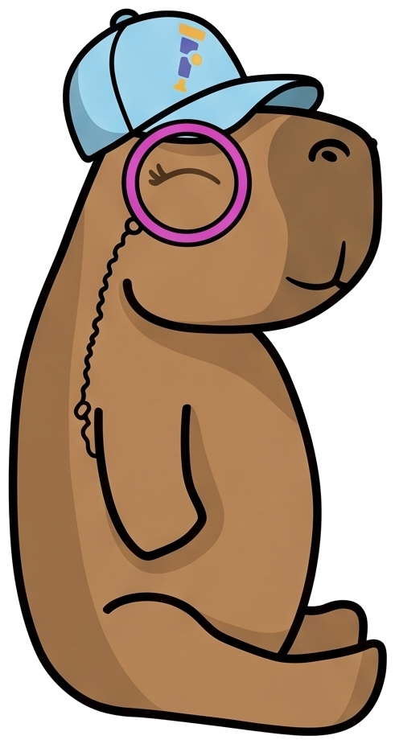
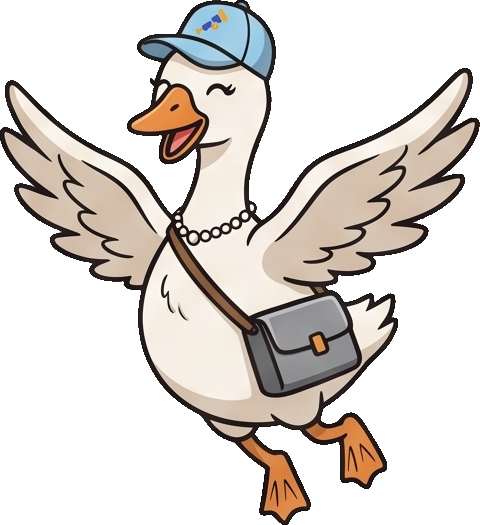

# Your Agent Did What?

**Forensic Observability for Systems That Don't Leave Obvious Footprints**
A conference talk by **Kasper Borg Nissen** (Dash0) and **Adriana Villela** (Dynatrace), and
the demo every factual claim in it comes from.

> GenAI observability is fragmented — OpenInference, OpenLLMetry and framework conventions all
> naming the same things differently. OpenTelemetry is where they converge. This talk maps that
> honestly, bridges the gap at the collector with `gen_ai_normalizer`, and then asks the harder
> question: something just deleted a database — what does your telemetry actually tell you?

**SREday London**, then **OSS Summit EU** in October.

---

## The cast

<table>
<tr>
<td width="130" align="center"></td>
<td><strong>Capybara, SRE</strong> — Java · Quarkus + LangChain4j · tools over MCP · judged by a
second model.<br>Emits <code>gen_ai.*</code> from the framework, and loses the tool call's
content on the MCP path.</td>
</tr>
<tr>
<td width="130" align="center"></td>
<td><strong>Beaver, SRE</strong> — Python · Anthropic SDK · instrumented by OpenInference.<br>
Emits no OTel vocabulary at all; the collector rewrites it in flight — most of it.</td>
</tr>
<tr>
<td width="130" align="center"></td>
<td><strong>Otter, SRE</strong> — the same Python agent, instrumented by OpenLLMetry.<br>
Emits <code>gen_ai.*</code> natively, needs no normalizing, and is the only one of the three
that records what a tool returned.</td>
</tr>
<tr>
<td width="130" align="center"></td>
<td><strong>goose</strong> — a developer's own coding agent, and the one that did it.<br>
Asked to tidy up the free plan, it calls <code>delete_records</code> through an MCP server
holding <code>deploy_svc</code> credentials. Nobody granted the agent anything; the root cause
is a grant, not a bug.</td>
</tr>
</table>

The three SRE agents get the same question about the same incident, with the same tools, MCP
server, database and collector — so anything that differs in the telemetry belongs to the
platform, not the story. goose is not asked anything. goose is what happened.

---

## Run it

Same three commands either way:

```bash
cd demos
cp .env.template .env      # then set ANTHROPIC_API_KEY
./00_run.sh                # cluster, database, agents  (~5 min cold)
./01_start-demo.sh         # port-forwards, waits until they answer
```

Then open **<http://localhost:8088>** and pick an agent. `demos/.env` is git-ignored; only
`.env.template` is committed.

### Option 1 · On your machine

**Needs** Docker, kind, kubectl, helm, JDK 21, Python 3.11+, an Anthropic API key, and — for
the coding agent that causes the incident — [goose](https://block.github.io/goose/) v1.46.0 or
newer plus Ollama:

```bash
brew install block-goose-cli
ollama pull qwen3.6:35b-a3b-q4_K_M
demos/agents/goose/run-recipe.sh
```

Ollama has to be on the host: Docker cannot pass the GPU through on a Mac, so a containerised
one falls back to CPU.

### Option 2 · In the devcontainer

Open the repo in a devcontainer (VS Code, or `devcontainer up`). Everything above is
preinstalled — Docker-in-Docker, kind, kubectl, helm, k9s, JDK, Python, goose — so only
`ANTHROPIC_API_KEY` is yours to provide.

The one difference is the coding agent: **goose runs on Anthropic in here, not Ollama.** There
is no GPU to pass through, and a model small enough to be tolerable on CPU cannot be relied on
to actually call `delete_records` — which is the only thing that run has to do.
`run-recipe.sh` detects the container and switches by itself; force either with
`GOOSE_PROVIDER=ollama|anthropic`.

Both were measured on 2026-08-19 and leave the same evidence: three free-plan rows gone, an
audit trail reading `client=goose · db_user=deploy_svc`, and seven goose spans in one trace
carrying `gen_ai.tool.call.arguments` and `.result`. The only thing that differs is
`gen_ai.request.model`.

> Any deploy or `kubectl set env` replaces a pod and takes the port-forward with it, so the
> console appears to die. Re-run `./01_start-demo.sh`.

The deletion is a real coding-agent run. When that is inconvenient — no Ollama, a bad network,
a model that will not call the tool — `POST /incident/rehearse-deletion` reproduces the database
state with the same credentials, so the investigation half stands on its own. See
[the extra door](demos/README.md#the-extra-door) for what it does and does not give you.

---

## Verifying the agents in Jaeger

`./01_start-demo.sh` forwards Jaeger to **<http://localhost:16686>**. Check this before every
rehearsal: a silent instrumentation regression looks exactly like a working demo.

**Services reporting.** The dropdown should list `capybara-sre`, `beaver-sre`, `otter-sre`,
`capybara-db-mcp`, `prod-db-mcp`, and `goose` once the recipe has run. A missing one has not
been asked anything yet, or its exporter never connected.

**One question, one trace.** Open the newest trace for a service: a single tree rooted at
`invoke_agent`, with `chat` and `execute_tool` beneath it — not a scatter of unparented spans.

**The trace crosses into MCP.** Expand `execute_tool` and the MCP server's spans should be
inside it, with the `SELECT` below them. That join exists only because `traceparent` rides in
the request's `params._meta`. Redeploy with `CAPYBARA_MCP_PROPAGATE_CONTEXT=false` to watch it
break on purpose.

**Each agent speaks its own vocabulary.** Open a `chat` span and read the tags:

| Service | Expect | Because |
|---|---|---|
| `capybara-sre` | `gen_ai.*` | quarkus-langchain4j emits them directly |
| `otter-sre` | `gen_ai.*` | OpenLLMetry 0.62.3 already emits the conventions |
| `beaver-sre` | **both** `llm.*` **and** `gen_ai.*` | the collector normalizes it, and `remove_originals: false` keeps both |

Beaver carrying both at once is the check that `gen_ai_normalizer` is in the pipeline. Only
`llm.*` means the processor is not running; only `gen_ai.*` means someone set
`remove_originals: true` and the before/after demo is gone.

**The forensic attributes.** On a tool span, look for `gen_ai.tool.call.arguments` and
`.result`. The finding the talk turns on is that the libraries do not write them — only our
hand-written spans do. If they start appearing everywhere, an upstream release has changed the
story and the slide needs revisiting.

**What is correctly absent.** `gen_ai.evaluation.result` is an event in the logs data model,
not a span, so Jaeger will not show it. Read those — and check spans are arriving at all — from
the collector:

```bash
kubectl logs -l app.kubernetes.io/name=opentelemetry-collector -f
```

> If the dropdown lists services that no longer exist, Jaeger's store is in memory.
> `kubectl rollout restart deployment/jaeger` clears it, and clears your traces with it — so
> before a rehearsal, never during one.

---

## What the demo demonstrates

Four findings, measured rather than asserted — all in
[`demos/ANALYSIS.md`](demos/ANALYSIS.md) with dates and versions:

- **The MCP path loses the tool call's content.** 4 span attributes against 6 on the local
  path; no arguments, no result. A *framework* gap, not an MCP gap.
- **The MCP path also loses the trace, at one named hop.** The tool body runs on a new
  duplicated Vert.x context, so its SQL starts a root trace of its own —
  [quarkus-mcp-server#789](https://github.com/quarkiverse/quarkus-mcp-server/issues/789), open.
- **The normalizer converts the structure, not the result.** Arguments carry across; the
  tool's result has no mapping. The same missing half, reached by a different road.
- **Evaluations are log records, not span events.** Which is what the convention asks for, and
  what most implementations get wrong.

---

## Where the slides live

The deck is maintained in **Google Slides** — **link TBD**.

This repo keeps [`outline.md`](outline.md): what each slide has to land, and in what order.
The speaker notes, the type spec, the HTML deck the Slides version was built from and that
deck's element exports are kept outside the repo on purpose — 71 MB of rendered PNGs, and a
second copy of something now maintained elsewhere. [`AGENTS.md`](AGENTS.md) records where they
live and how to work in here.

---

## What's in here

| Path | What it is |
|---|---|
| [`demos/`](demos/) | The demo: three SRE agents, one coding agent, one incident, one collector, in kind. |
| [`demos/README.md`](demos/README.md) | How to run it on stage — the flow, what to watch, what breaks. |
| [`demos/ANALYSIS.md`](demos/ANALYSIS.md) | The measurements. The talk's evidence base. |
| [`outline.md`](outline.md) | The talk slide by slide: sections, timing, what each slide must land. |
| [`abstract.md`](abstract.md) | The submitted abstract. |
| [`research.md`](research.md) | Everything the talk is sourced from, and the state of the standards. |
| [`mascots/`](mascots/) | 42 transparent cut-outs — capybara, beaver, otter, goose. |
